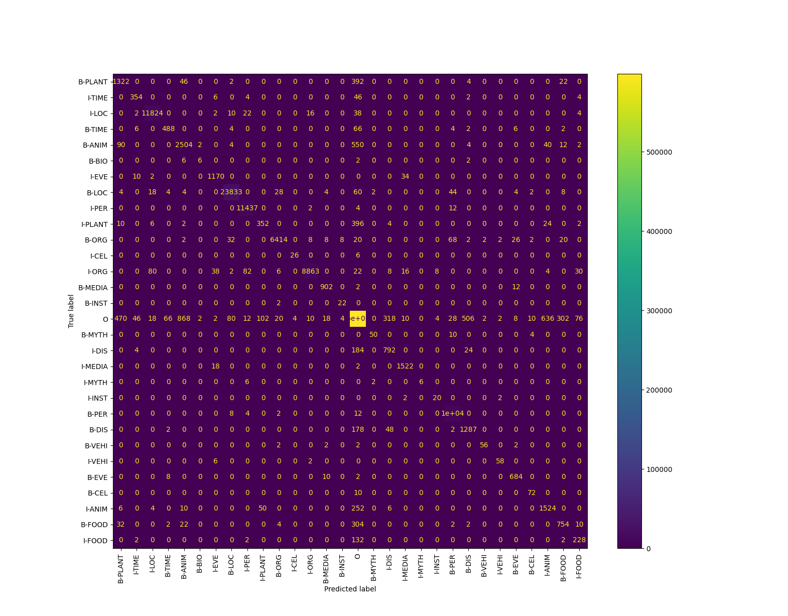
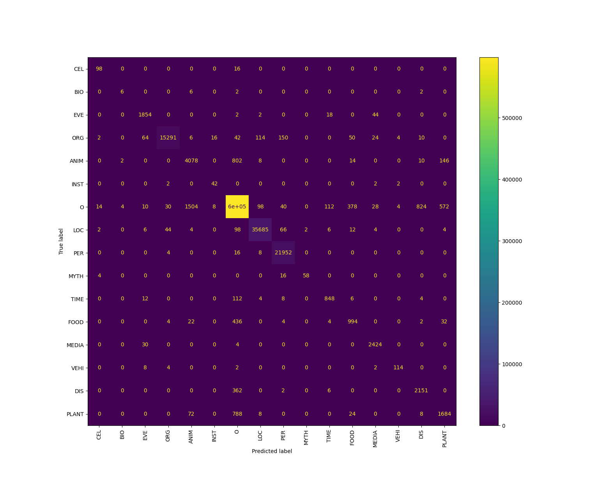
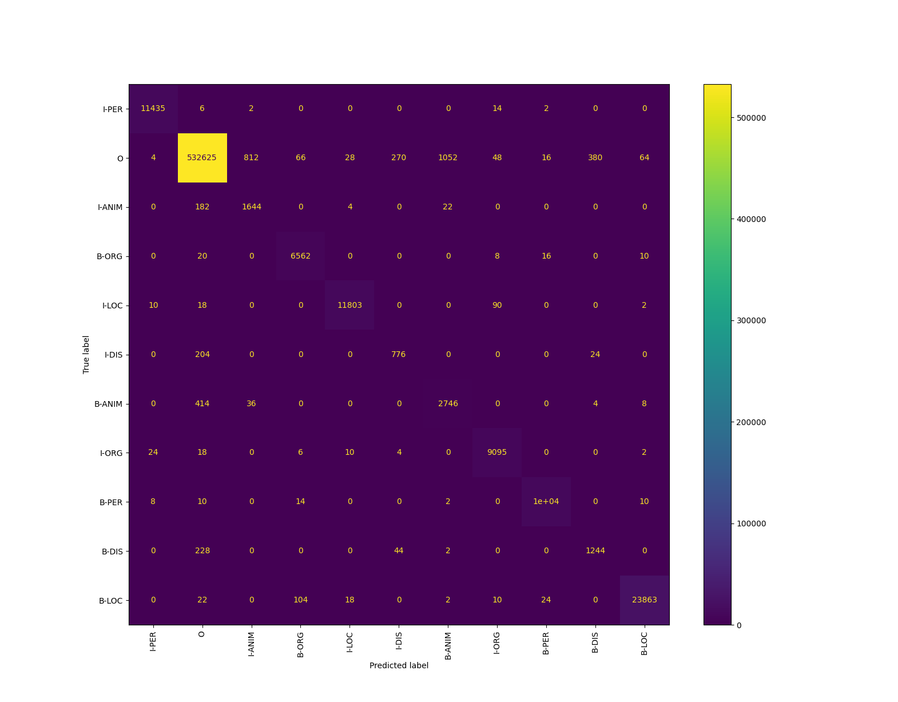
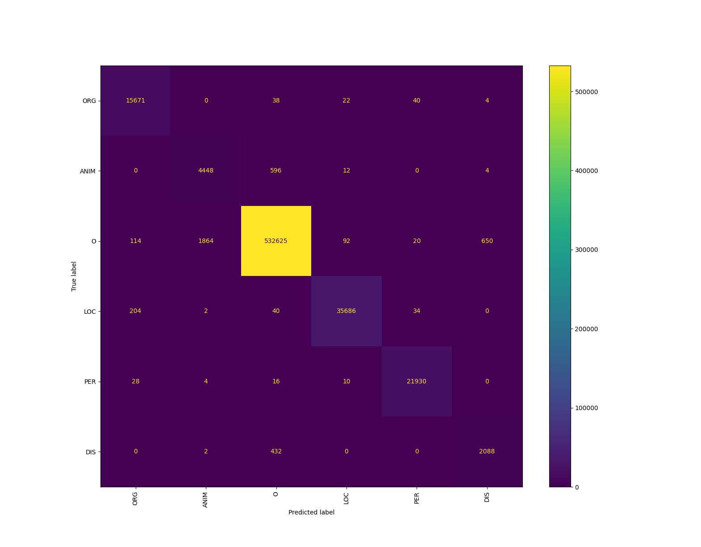

# MultiNERD NER

This is a NER project based on the [transformers](https://huggingface.co/docs/transformers/index) and [datasets](https://huggingface.co/docs/datasets/index). The model used is [RoBERTa-base](https://huggingface.co/roberta-base), a language model pretrained with text from the english language, first introduced in [RoBERTa: A Robustly Optimized BERT Pretraining Approach](https://arxiv.org/abs/1907.11692), and released in this [repository](https://github.com/facebookresearch/fairseq/tree/main/examples/roberta).

Two models are trained for two different versions of the dataset. These models are callsed <b>Model A</b> and <b>Model B</b>.

## Repository contents

* ```MultiNERD_exploration.ipynb``` where an initial exploration of the dataset is performed.
* ```Model_A.ipynb``` where the version called <b>Model A</b> is trained and the test results are produced.
* ```Model_B.ipynb``` where the version called <b>Model B</b> is trained and the test results are produced.
* ```Model_results_exploration.ipynb``` where the results of the models are further explored.

## 1. Setting up the environment

To run the notebooks first run

```bash
    pip install -r requirements.txt
```
## 2. Exploration
Use the ```MultiNERD_exploration.ipynb``` notebook to explore different aspects of the dataset such as:
* Size
* Ratio of named entities vs "O" out of scope entities
* Distributions of named entities in the dataset
* Average lenghts of the entities with the text on the word and token level (for the model tokenizer)

## 3. Training
Use the ```Model_A.ipynb``` and ```Model_B.ipynb``` notebooks to train the model in two different setups, ***A*** and ***B***.

The hyperparameters used in training are:

```json
{
"epochs": 20 (using early stopping),
"learning_rate": 0.00003,
"batch size": 64 (8 actual and 8 accumulation)
}
```

### 3.1. Model A
Model A is trained to identify the <b>Person</b> (PER), <b>Location</b> (LOC), <b>Organization</b> (ORG}), <b>Animal</b> (ANIM), <b>Biological entity</b> (BIO), <b>Celestial Body</b> (CEL), <b>Disease</b> (DIS), <b>Event</b> (EVE), <b>Food</b> (FOOD), <b>Instrument</b> (INST), <b>Media</b> (MEDIA), <b>Plant</b> (PLANT), <b>Mythological entity</b> (MYTH), <b>Time</b> (TIME) and <b>Vehicle</b> (VEHI) entities.

### 3.2. Model B
Model A is trained to identify the <b>Person</b> (PER), <b>Location</b> (LOC), <b>Organization</b> (ORG}), <b>Animal</b> (ANIM), and <b>Disease</b> (DIS) entities.

## 4. Evaluation
Use the ```Model_results_exploration.ipynb``` notebook to explore results of the models on the test partition of the dataset. The results of this exploration are:
* The confusion matrices
* Ratio of named entities that are "leaked" towards the "O" out of scope entities

### 4.1. Model A

```text
                  precision    recall  f1-score   support

        ANIM       0.69      0.77      0.73      3208
         BIO       0.60      0.38      0.46        16
         CEL       0.73      0.80      0.77        82
         DIS       0.67      0.84      0.74      1517
         EVE       0.89      0.95      0.92       704
        FOOD       0.62      0.63      0.63      1132
        INST       0.53      0.75      0.62        24
         LOC       0.99      0.99      0.99     24015
       MEDIA       0.94      0.98      0.96       916
        MYTH       0.89      0.75      0.81        64
         ORG       0.98      0.96      0.97      6614
         PER       0.98      1.00      0.99     10525
       PLANT       0.60      0.66      0.63      1788
        TIME       0.79      0.81      0.80       578
        VEHI       0.88      0.88      0.88        64

   micro avg       0.93      0.95      0.94     51247
   macro avg       0.78      0.81      0.79     51247
weighted avg       0.93      0.95      0.94     51247
```

***Tag level confusion matrix (IOB)***



***Entity level confusion matrix***



### 4.2. Model B

```text
              precision    recall  f1-score   support

        ANIM       0.68      0.84      0.75      3208
         DIS       0.71      0.81      0.76      1518
         LOC       0.99      0.99      0.99     24043
         ORG       0.96      0.99      0.98      6616
         PER       0.99      1.00      0.99     10529

   micro avg       0.95      0.97      0.96     45914
   macro avg       0.87      0.93      0.89     45914
weighted avg       0.96      0.97      0.97     45914
```
***Tag level confusion matrix (IOB)***



***Entity level confusion matrix***



